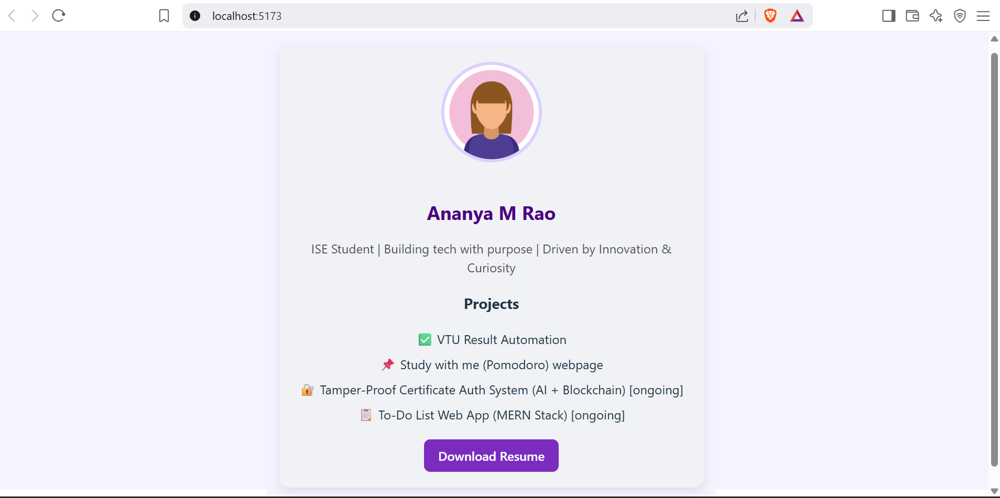

# 👩‍💻 Ananya M Rao - Profile Card Resume

This is a modern, responsive profile card built using **React.js** and styled with **CSS**. It showcases my personal profile, skills, and projects in a simple and elegant layout. It also includes a link to download my resume.

---

## 🌟 Features

- Responsive layout and centered profile card
- Smooth hover effects and transitions
- Clean and soft color palette
- Includes personal photo, bio, and project list
- Resume download button

---

## 🚀 Technologies Used

- **React.js**
- **CSS3** (custom styling)
- Flexbox for layout
- Hover effects & transitions

---

## 📸 Demo

 <!-- Replace with your actual screenshot if available -->

---

## 📝 Projects Showcased

- ✅ VTU Result Automation
- 📌 Study With Me (Pomodoro) Webpage
- 🔐 Tamper-Proof Certificate Authentication System (AI + Blockchain) [ongoing]
- 📋 To-Do List Web App (MERN Stack) [ongoing]

---


## 📄 Resume

Download my resume directly from the card or click below:

👉 [Download Resume](./Ananya_Resume.pdf) <!-- Replace with your actual resume file path -->

---

## 🛠️ Setup Instructions

1. Clone the repository:

```bash
git clone https://github.com/ananya0707/My-Profile.git
cd My-Profile


2.Install dependencies:

```bash
npm install
```

3.Start the development server:

```bash
npm start
```